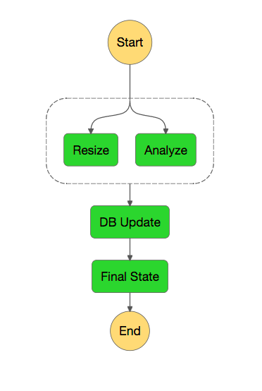

# Image Pipeline Demo for AWS Lambda

This project contains AWS Lambda function definitions intended to create a image processing pipeline with AWS Step Functions.

* `image-pipeline-trigger`: Intended to be triggered by Object Create events in an S3 bucket, it will generate a unique ID for the event, and trigger the Step Function with that ID, and the bucket name and object key.
* `image-resize`: Will create an image thumbnail (using 50% scaling) and drop it into a different S3 bucket.
* `image-analysis`: Uses AWS Rekognition to generate tags for the image.
* `image-db-update`: Stores the location of the thumbnail as well as the tags in a DynamoDB table.
* `image-api`: Read-only API that accesses DynamoDB table.

The S3 Buckets, DynamoDB table, Step Function, and Lambdas are all provisioned using the SAM template `sam-template.yml`.



## Testing with SAM Local

[SAM Local](https://github.com/awslabs/aws-sam-local) is a CLI tool that allows you to invoke Lambdas locally. Here are some tests for these functions.

*NOTE: You will need to change the contents of test-env.json and <lambda_dir>/test-event.json to point to data you own, or these commands won't work!*

`image-analysis`:

```
sam local invoke ImageAnalysis -e image-analysis/test-event.json
```

`image-api`:

```
sam local start-api --env-vars test-env.json
```

This starts a local copy of the AWS API Gateway. It will show you what endpoints you can test.

`image-db-update`:

```
sam local invoke ImageDbUpdate -e image-db-update/test-event.json --env-vars ./test-env.json
```

`image-pipeline-trigger`:

```
sam local invoke ImagePipelineTrigger -e image-pipeline-trigger/test-event.json --env-vars ./test-env.json
```

`image-resize`:

```
sam local invoke ImageResize -e image-resize/test-event.json --env-vars ./test-env.json
```
